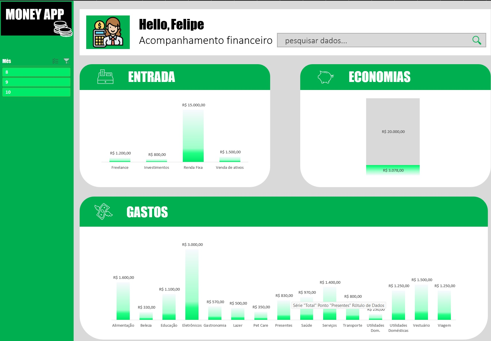

<a href="https://dio.me/">

# Projeto como organizar sua vida financeira com planilhas inteligentes e IA

 > ℹ️ **NOTE:** Este é o repositório desenvolvido durante o desafio do bootcamp CAIXA - IA Generativa com Microsoft Copilot em parceria com a [DIO](https://dio.me)

Projeto com o objetivo de criar uma planilha utilizando conhecimentos de excel e ferramentas de IA.

Apliquei os conhecimentos adquiridos no desafio para modelar e extrair os dados de maneira mais eficiente e visualmente mais atrativo. Ao final, utilizamos a inteligência artificial para gerar insights valiosos a partir da planilha data.xlsx.

## 💻 Tecnologias utilizadas no projeto

- [Excel](https://www.microsoft.com/en/microsoft-365/excel)
- [ChatGPT](https://chat.openai.com/)

## ✨ Como foi feito ?

- Dashboard criado no Excel
- Dados importados da planilha data.xlsx

## 📚 Materiais
- [Dados](/src/data.xlsx)

## 🛠️ Instruções de execução

Utilize alguma ferramenta para trabalhar com planilhas, `Microsfor Excel`, `Libre Office Calc` ou `Google Sheets`. Baixe o arquivo de dados e crie gráficos que representem informações relevantes e que façam sentido para sua análise. Como referência, utilize a planilha disponibilizada na seção `Resultados`

## 🚀 Resultados
Este desafio proporcionou uma experiência prática e acessível sobre como extrair e criar gráficos informativos, tornando o processo mais visual, atrativo e até mesmo divertido de explorar.

- [Dashboard](/src/como-organizar-sua-vida-financeira.xlsx)

## 🧠 Prompts

ChatGPT：

|   Ação   | prompt                                                                                                                                                                                                                                                                         |
| :------: | ------------------------------------------------------------------------------------------------------------------------------------------------------------------------------------------------------------------------------------------------------------------------------ |
|  import  | Importe a planilha data.xlsx para o prompt do ChatGPT                                                        |
|  pergunta  | Utilize a tabela de dados contida no documento acima, como base de conhecimento e me gere alguns insights dessa tabela de gastos                                                        |

## 👨‍💻 Expert

    
    
&nbsp&nbsp&nbspFelipe M Ferreira 
    &nbsp&nbsp&nbsp
    <a href="https://github.com/felipeb2a">
    GitHub</a>&nbsp;|&nbsp;
    <a href="https://www.linkedin.com/in/felipe-marques-ti/">LinkedIn</a>
&nbsp;|&nbsp;
    <a href="https://www.instagram.com/felipeb2a/">
    Instagram</a>
&nbsp;|&nbsp;

  

---

⌨️ com 💜 por [Felipe M Ferreira](https://github.com/felipeb2a)